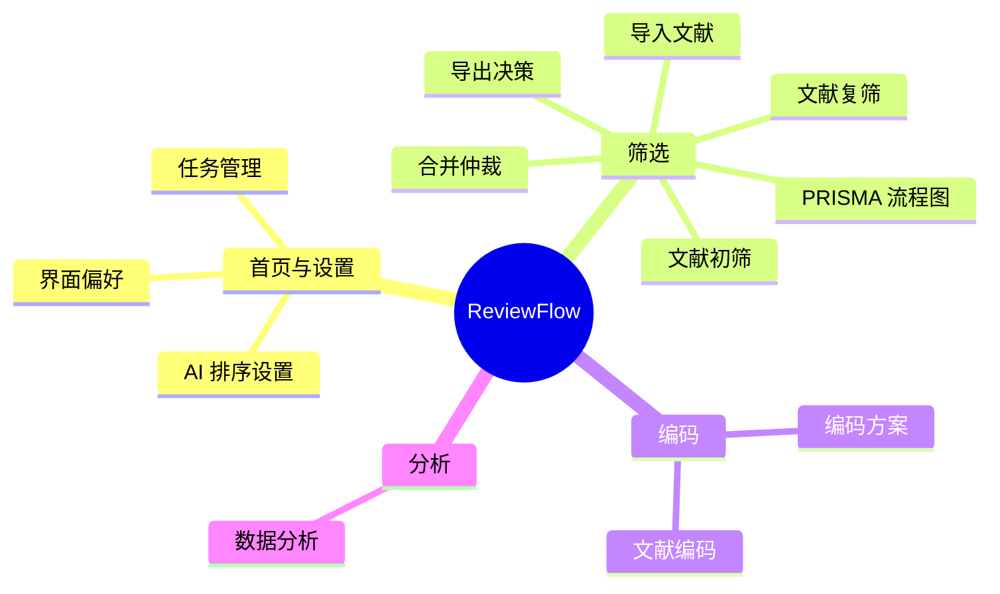
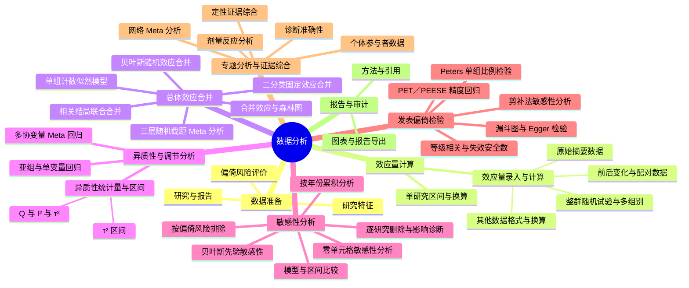

# ReviewFlow 导航层级图与交互规格

基线：custom_frontend_unified.zip；仅修改展示层、导航和页面状态。保留静态控件 ID、所有接口字段/枚举/路径，以及统计处理脚本。

## 1. 全站层级图（先确定语义，再实现）

“首页与设置”为全局入口，不归入筛选。三个阶段是导航分组，不虚构新的业务页面。任务名是数据上下文，独立显示，不再充当功能菜单或路径层级。所有页面标题、侧栏和面包屑使用同一注册表。

## 2. 数据分析层级图

说明：“图表与报告导出”为方法页面内的上下文操作，保留原有导出处理，不新增独立计算页面，也不计入 31 个方法入口。

这里的目录是产品的信息组织，不宣称所有论文必须使用同一套章节或全部方法。Q/I²/τ²使用现有合并结果，不能生成伪独立“检验”结果；研究偏倚风险评价与发表偏倚分开。漏斗图不对称和失效安全数不被标为发表偏倚的确证。专题方法保留其原有适用范围。

## 3. 路径及同级菜单

- 页面路径：`筛选 / 文献初筛`；分析方法路径：`分析 / 数据分析 / 敏感性分析 / 模型与区间比较`。
- 阶段按钮用于阶段选择；实际页面及分析类别有可点击链接。独立的展开按钮及鼠标悬浮可显示同层级入口；不把不同层级混成平铺列表。
- 面包屑路径仅对当前叶节点设置 `aria-current=page`；各独立同级菜单可标出当前项。支持键盘、Escape、点击外部、触屏及浏览器前进后退。
- 规范片段为 `#workspace/<page>` 与 `#workspace/analysis/<group>/<tool>`。旧 `#an...` 深链接继续兼容。

## 4. 全部方法

- “显示全部”改为“全部方法”，显示实际注册的入口数量。重复点击仍停留在目录，不偷偷切换回表单；返回使用明确的“返回当前方法”按钮。
- 打开的是按分析模块分组的可搜索目录，不挂载第二套表单、不运行请求、不展开所有 details。
- 从具体方法进入时保存方法、配置草稿、结果、滚动位置；“返回当前方法”及 Escape 可恢复。
- 目录支持分类过滤、真实命中数、清空和无结果状态；选择方法直接定位。
- 过渡仅作用于目录/内容层，约 150ms 淡入与轻微位移；尊重 prefers-reduced-motion；不对长表单做高度动画。

## 5. 背景色角色

- 全部工作区的底色 → `--bg`。
- 编辑卡片/工具栏 → `--surface`。
- 非交互的柔和子区域 → 单一 `--surface-subtle`。
- 阅读器周边 → `--reader-stage`；PDF 纸张与出版图 → 白色 `--document-paper`（不滤色）。
- 纳入/待定/排除、警告、手动覆盖和原文高亮保持语义色，不“一键染成灰色”。
- 登录品牌背景独立保留；不改写文献、用户内容或 SVG/Canvas 导出的颜色。

## 6. 回归门槛

每个注册入口可达、无重复静态控件 ID；标题/路径/侧栏一致；未知片段安全回退；交互不改变接口机器值；全部方法导航不触发统计请求；10 工作区的明暗底色一致；阅读器和出版纸张保留；目录、菜单在 1440/1280/768/390px 下可用；减少动态效果模式无非必要动画。真实后端数值、认证和报告导出仍需原项目联调。

## 参考规范（截至本次查询）

- Cochrane Handbook，Chapter 10，Analysing data and undertaking meta-analyses：https://www.cochrane.org/authors/handbooks-and-manuals/handbook/current/chapter-10
- Cochrane Handbook，Chapter 13，Assessing risk of bias due to missing evidence：https://www.cochrane.org/authors/handbooks-and-manuals/handbook/current/chapter-13
- W3C APG，Breadcrumb：https://www.w3.org/WAI/ARIA/apg/patterns/breadcrumb/
- W3C APG，Disclosure navigation：https://www.w3.org/WAI/ARIA/apg/patterns/disclosure/examples/disclosure-navigation/

## 7. 实施时发现并一并修复的可见性问题

替代录入方式及二分类/单组计数、剂量、网络、个体数据模块会读取同一组来源字段。按当前方法将这些原控件移动到可见区域，不复制输入框，也不改请求字段。只有需要方向或页码的入口才显示相应控件。零单元格页面显示原事件数输入，并保持数值填入后的标签可见；不显示与本页预览无关的全局效应指标选择器。

任务切换后，显式进入的漏斗图/Egger 或累积分析入口恢复对应的原方法枚举，但不会恢复上一个任务的模型、数据或结果。
